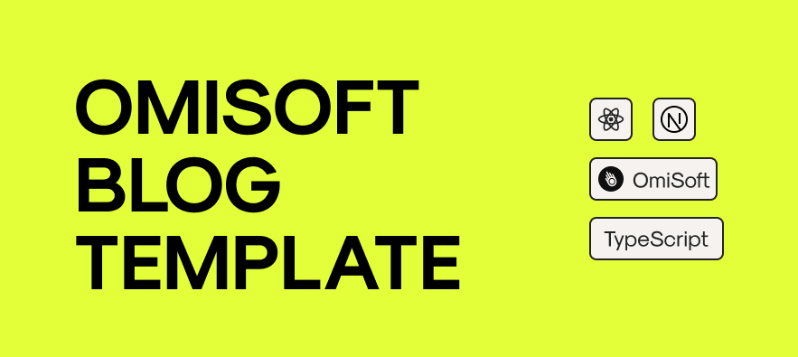
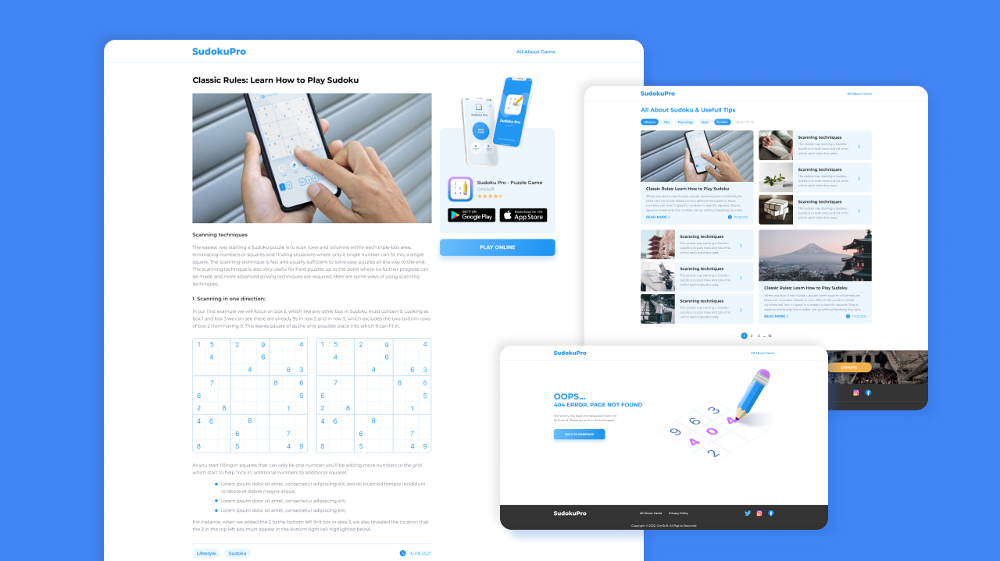

# OMISOFT BLOG EXAMPLE - FRONT END

Here you can find a simple boilerplate for a Blog based on React.js & Next.js. We use this code in the project [SudokuPro.app](https://sudokupro.app)

To run this app use next commands:

```bash
npm run i
npm run dev
```

Open [http://localhost:4000](http://localhost:4000) with your browser to see the result.

## Project Structure

This blog consists of three different parts:

- [Front End side](https://github.com/OmiSoftNet/omisoft-blog-template-front)
- [Back End side](https://github.com/OmiSoftNet/omisoft-blog-template-back)
- [Admin Panel](https://github.com/OmiSoftNet/omisoft-blog-template-admin)

## Preview



## Created by
[OmiSoft](https://omisoft.net/?utm_source=github&utm_medium=social)

[![OmiSoft.net Facebook page][1.1]][1]
[![OmiSoft.net Twitter page][2.1]][2]

[1]: http://www.facebook.com/omisoftnet
[2]: http://www.twitter.com/omisoftnet

[1.1]: http://i.imgur.com/fep1WsG.png (OmiSoft.net Facebook page)
[2.1]: http://i.imgur.com/wWzX9uB.png (OmiSoft.net Twitter page)

## License
OMISOFT BLOG EXAMPLE is released under the MIT license.  
See the [LICENSE](./LICENSE.md) for details.
